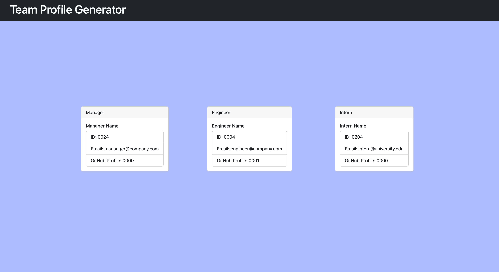

# Team Builder: Profile Generator

## Description
- An Object-Oriented Programming challenge, this application allows a user to input information about their team members in a command-line interace, and output a HTML file that represents the team in a clean summary. 
- Testing has been employed to ensure that the user will not encounter issues. 

## Criteria and Packages Used
- Application utilizes: 
    - `Inquirer`: Provides an upgraded command line interface for Node.js
    - `jest`: Versatile testing suite for various processes throughout the development phase
    - `handlebars`: For rendering partials, and dynamic templating engine

## Walkthrough Video of the Application
[Video](https://drive.google.com/file/d/1F7n2IMb18Mc4H1GG6dgdxSqJR8QcPGn_/view)

## Screenshot of the Application

## Questions, Contributors and Contact
Contact: brandtdavidson@gmail.com

jest Tests provided by instructor (University of Arizona, 2U Trilogy Education)